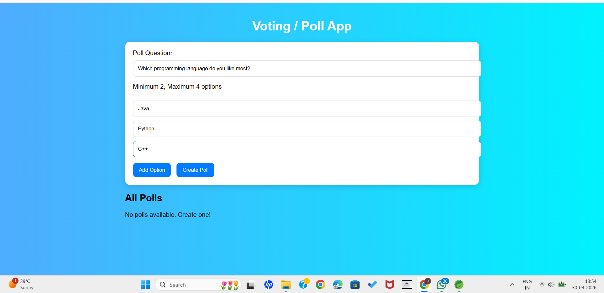
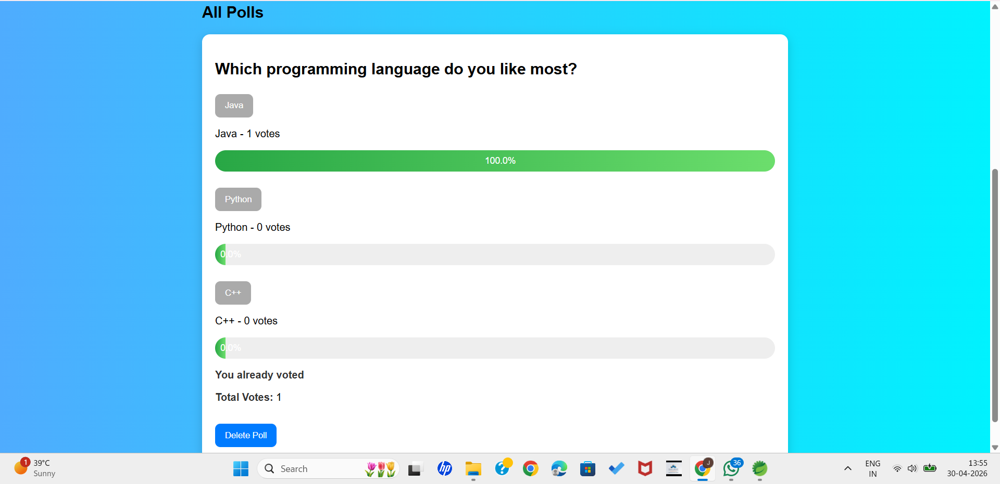

# Voting Poll App

## 📌 Overview

A full-stack polling application where users can create polls, vote on options, and view live results with percentage-based progress bars.

---

## 🚀 Features

* Create polls with 2–4 options
* Vote on polls
* Real-time results with percentages
* Progress bar visualization
* Prevent duplicate voting (using localStorage)
* Delete polls
* Clean and responsive UI

---

## 🛠 Tech Stack

* **Backend:** Java, Spring Boot
* **Frontend:** HTML, CSS, JavaScript
* **Database:** In-memory (Array/List)

---

## 🔗 API Endpoints

| Method | Endpoint         | Description       |
| ------ | ---------------- | ----------------- |
| GET    | /polls           | Get all polls     |
| POST   | /polls           | Create a new poll |
| POST   | /polls/{id}/vote | Vote on a poll    |
| DELETE | /polls/{id}      | Delete a poll     |

---

## ▶️ How to Run

1. Open project in Spring Tool Suite
2. Run the main class
3. Open browser and go to:

```
http://localhost:8080
```

---

## 📸 Screenshots

### Create Poll



### Poll Created


### Voting Results



---

## ✅ Project Structure

```
votingapp/
 ├── src/main/java/        (Backend - Controllers, Services, Models)
 ├── src/main/resources/static/  (Frontend - HTML, CSS, JS)
 ├── screenshots/          (Project screenshots)
 ├── pom.xml
 ├── README.md
```

---

## 🎯 Key Highlights

* Clean separation of frontend and backend
* RESTful API design
* Dynamic UI updates using JavaScript
* User-friendly interface

---

## 📌 Future Improvements

* Add database (MySQL / MongoDB)
* User authentication
* Real-time updates using WebSockets
* Deploy to cloud

---

## 👩‍💻 Author

Gayathri
